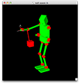

## [JSK EusLisp repository](http://jskeus.sourceforge.net) [](https://travis-ci.org/euslisp/jskeus)

[](https://gitter.im/euslisp/jskeus?utm_source=badge&utm_medium=badge&utm_campaign=pr-badge&utm_content=badge)


This repository contains software developed and used by [JSK](http://www.jsk.t.u-tokyo.ac.jp) at The University of Tokyo.

## 1. Getting started

### 1.1 Install binary (RECOMMENDED: Ubuntu 14.04)

#### 1.1.1 Setup ROS repository
```
sudo sh -c 'echo "deb http://packages.ros.org/ros/ubuntu `lsb_release -cs` main" > /etc/apt/sources.list.d/ros-latest.list'
wget http://packages.ros.org/ros.key -O - | sudo apt-key add -
echo "source /opt/ros/indigo/setup.bash" >> ~/.bashrc
sudo apt-get update
```
#### 1.1.2 Install Euslisp
```
sudo apt-get install ros-indigo-euslisp
```

### 1.2 Install via Homebrew (OSX)
```
brew install euslisp/jskeus/jskeus
```

## 2 Playing with Demo programs

### 2.1 Motion generation
```
$ irteusgl irteus/demo/demo.l
```
and type any command, such as '(crank-motion)' or '(dual-arm-ik)'


[](https://github.com/euslisp/jskeus/blob/master/irteus/demo/full-body-ik.l)
[](https://github.com/euslisp/jskeus/blob/master/irteus/demo/dual-arm-ik.l)
[](https://github.com/euslisp/jskeus/blob/master/irteus/demo/dual-manip-ik.l)
[](https://github.com/euslisp/jskeus/blob/master/irteus/demo/crank-motion.l)
[](https://github.com/euslisp/jskeus/blob/master/irteus/demo/hand-grasp-ik.l)
[](https://github.com/euslisp/jskeus/blob/master/irteus/demo/hanoi-arm.l)
[](https://github.com/euslisp/jskeus/blob/master/irteus/demo/particle.l)
[](https://github.com/euslisp/jskeus/blob/master/irteus/demo/null-space-ik.l)

### 2.2 Robots and objects models
```
$ irteusgl models/irt-all-robots.l "(make-all-robots)"
```


```
$ irteusgl models/irt-all-objects.l "(make-all-objects)"
```


## 3 Getting started for ROS and PR2 users

### 3.1 Install binaries (RECOMMENDED: Ubuntu 14.04)

#### 3.1.1 Setup ROS repository

You can skip this procedure if you have already setup your ROS system
```
sudo sh -c 'echo "deb http://packages.ros.org/ros/ubuntu `lsb_release -cs` main" > /etc/apt/sources.list.d/ros-latest.list'
wget http://packages.ros.org/ros.key -O - | sudo apt-key add -
echo "source /opt/ros/indigo/setup.bash" >> ~/.bashrc
sudo apt-get update
```
#### 3.1.2 Install pr2/euslisp programs

```
sudo apt-get install ros-indigo-pr2eus
```

### 3.3 Running demo programs

#### 3.3.1 Visualization of pr2 robot
```
$ rosrun euscollada pr2.sh
```


#### 3.3.2 For real PR2 users

After you set `ROS_MASTER_URI` and `ROS_IP` to your PR2 robot (or simulated PR2), try the following command:

```
$ roscd pr2eus
;; read joint state and display in euslisp viewer, print jacobian
$ roslaunch ./pr2-read-state.launch
;; sample program to show how to make pr2 posture from euslisp, THIS WILL MOVE REAL ROBOT, CAUTION!!!
$ roslaunch ./pr2-send-joints.launch
```

You can use our script to set  `ROS_MASTER_URI` and `ROS_IP`
```
$ source `rospack find jsk_tools`/src/bashrc.ros
$ rossetrobot pr1012.jsk.com # change to your environment
$ rossetip

```


Have a look at roseus package in http://github.com/jsk-ros-pkg repository for ROS client library for euslisp

### 3.4 Support and Trouble Shooting


Open an issue on our [issue tracker](https://github.com/euslisp/jskeus/issues) if something doesn't work as expected, or if you want new features implemented.

Use the [pull requests](https://github.com/euslisp/jskeus/pulls) system to send us solutions for the issues so we can implement them in this repository.

### 3.5 Online Documents (Currently only Japanese is available)

See online [manual](http://euslisp.github.io/jskeus/)

PDF files are also available from [here](https://github.com/euslisp/jskeus/raw/master/doc/jmanual.pdf)

### 3.6 Install euslisp from source code  (EXPERTS ONLY)

#### 3.6.1 Installing dependent libraries

For Ubuntu users:
```
$ sudo apt-get install git make gcc g++ libjpeg-dev libxext-dev libx11-dev libgl1-mesa-dev libglu1-mesa-dev libpq-dev libpng12-dev xfonts-100dpi xfonts-75dpi gsfonts-x11 texlive-fonts-extra xfonts-100dpi-transcoded xfonts-75dpi-transcoded msttcorefonts
```

For Mac OSX users using Homebrew:
```
$ brew install jpeg libpng mesalib-glw wget
```

'''NOTE:'''
EusLisp needs X11 Library, but Mac OSX mountain lion no longer supports it. Given this case, you'll need to install [XQuartz](http://xquartz.macosforge.org/landing/).

Also for Mac OSX lion (or older) users it's better to install the latest XQuartz for safety and compatibility reasons.

(If XQuartz is older than 2.7.3, the installation of EusLisp will fail. You should install the latest XQuartz.)


For Raspberry Pi users using debian(Raspbian "wheezy"):
```
$ sudo apt-get install git gcc g++ libjpeg62-dev libxext-dev libx11-dev libgl1-mesa-dev libglu1-mesa-dev libpq-dev libpng12-dev xfonts-100dpi xfonts-75dpi
## additional install for using OpenGL on raspberry pi
$ sudo apt-get install libgl1-mesa-dri xserver-xorg-video-vesa xutils
```
For Cygwin(only works with 32bit systems)
```
Packages listed below should be intalled using setup.exe.

git, gcc-core, gcc-g++, make
libjpeg-devel, libpng-devel
libGL-devel, libGLU-devel, libglut-devel, libX11-devel, libXext-devel
xorg-server
X-start-menu-icons (for startxwin.exe)
mesa-demo (for glxinfo)
bitmap fonts (all bitmap font packages -75dpi, -100dpi, -misc )
```

#### 3.6.2 Downloading and building EusLisp
```
$ git clone http://github.com/euslisp/jskeus jskeus
$ cd jskeus
$ make
you will see instructions to add EUSDIR, ARCHDIR, PATH, LD_LIBRARY_PATH environment variable in your bashrc to invoke euslisp program
$ echo "source ~/bashrc.eus" >> ~/.bashrc
```

#### 3.6.3  Install ROS and jsk-ros-pkg repository

See http://wiki.ros.org/indigo/Installation/Source for more details

```
$ sudo apt-get install python-rosdep python-rosinstall-generator python-wstool python-rosinstall build-essential
$ mkdir -p ~/ros_catkin_ws/src
$ cd ~/ros_catkin_ws/src
$ wstool init src https://raw.githubusercontent.com/jsk-ros-pkg/jsk_pr2eus/master/.rosinstall
$ wget https://raw.githubusercontent.com/jsk-ros-pkg/jsk_travis/master/rosdep-install.sh
$ sh ./rosdep-install.sh
$ cd ..
$ catkin_make
$ source devel/setup.bash
```

### 3.7 Acknowledgment

Software in this repository is based on the [EusLisp language](http://euslisp.sourceforge.net).
